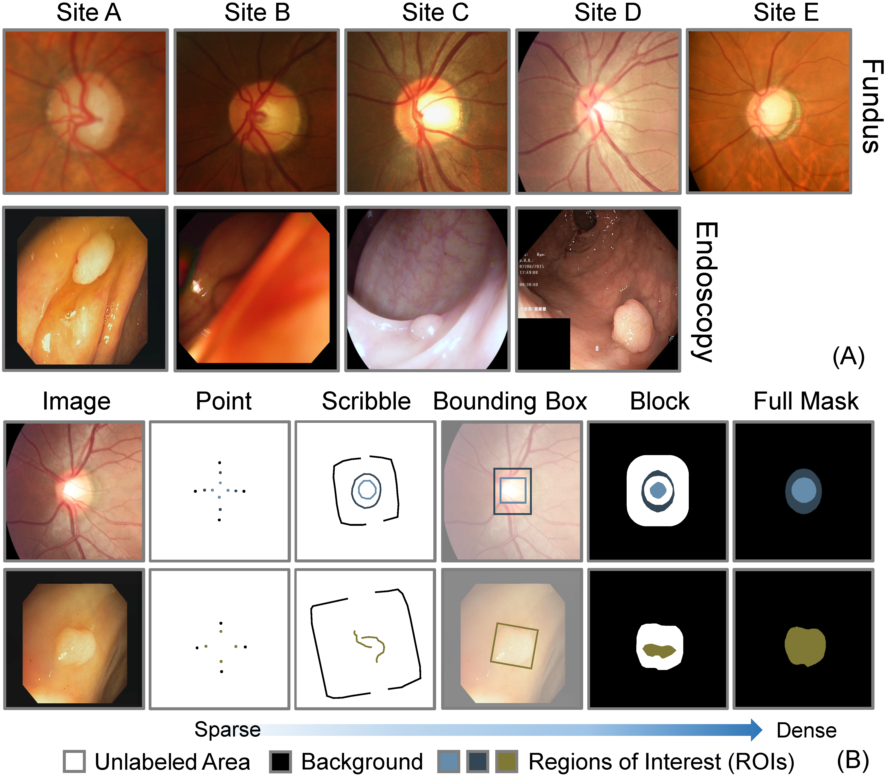

# FedLPPA: Learning Personalized Prompt and Aggregation for Federated Weakly-supervised Medical Image Segmentation
The official implementation of the paper: [**FedLPPA: Learning Personalized Prompt and Aggregation for Federated Weakly-supervised Medical Image Segmentation**](https://arxiv.org/abs/2402.17502)


# Datasets
## Download the Datasets


<table>
  <tbody>
    <tr>
      <td align="center">Fundus</td>
      <td align="center">OCTA</td>
      <td align="center">Endoscopy</td>
      <td align="center">Prostate MRI</td>
    </tr>
    <tr>
      <td align="center"><a href="https://github.com/llmir/FedICRA/tree/master/data">Download</a></td> 
      <td align="center"><a href="https://github.com/llmir/FedICRA/tree/master/data">Download</a></td>  
      <td align="center"><a href="https://">Download</a></td>  
      <td align="center"><a href="https://">Download</a></td>  
    </tr>

  </tbody>
</table>


## Details of Training set
Examples of the image and the sparse annotation from each site. The detailed information of datasets can be found in [here](https://arxiv.org/abs/2402.17502)


# Visualization Results


# Requirements
Some important required packages are lised below:
* Pytorch 1.10.2
* cudatoolkit 11.3.1
* efficientnet-pytorch 0.7.1
* tensorboardx 2.5.1
* medpy 0.4.0
* scikit-image 0.19.3
* simpleitk  2.1.1.2
* flwr 1.0.0
* Python >= 3.9
# Usage
## 1. Clone this project
``` bash
git clone https://github.com/llmir/FedLPPA.git
cd FedLPPA
```

## 2. Create a conda environment
``` bash
conda env create -n fed39v2 -f fed39v2.yaml
conda activate fed39v2
```
## 3. Pre-processing
Data preprocessing includes normalizing all image intensities to between 0 and 1, while data augmentation includes randomly flipping images horizontally and vertically as well as rotation (spanning from -45° to 45°).

## 4. Train the model
``` bash 
python flower_runner.py --port 8097 --procedure flower_pCE_2D_GateCRFMsacleTreeEnergyLoss_Ours --exp faz/WeaklySeg_pCE --base_lr 0.01 --img_class faz --model unet_lc_multihead --gpus 0 1 2 3 4 5 --strategy FedICRA --alpha 1 --rep_iters 3
```

## 5. Test the model
``` bash
python -u test.py --client client0 --num_classes 2 --in_chns 1 --root_path ../test/ --img_class faz --exp faz/ --min_num_clients 5 --cid 0 --model unet_lc_multihead
```

# Acknowledgement
* [WSL4MIS](https://github.com/HiLab-git/WSL4MIS)
* [flower](https://github.com/mher/flower)
